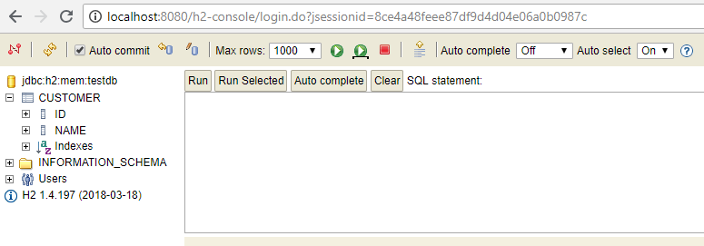

# spring-boot-h2-console
The main goal of this project is to show how to configure h2 console for 
Spring Boot web application.

_Reference_: [Spring Boot h2 console config](https://medium.com/@harittweets/how-to-connect-to-h2-database-during-development-testing-using-spring-boot-44bbb287570)

# preface
Often times during development we would want to look inside the database 
to view the schema or data. H2 is a perfect choice for in-memory databases 
during testing since we do not have to install the database.

In some cases, only one connection to a in-memory database is required. 
This means the database to be opened is private. In this case, the database 
URL is `jdbc:h2:mem:`.  
**Remark**: Opening two connections within the same virtual 
machine means opening two different (private) databases.

Sometimes multiple connections to the same in-memory database are required. 
In this case, the database URL must include a name. 
Example: `jdbc:h2:mem:db1`.  
**Remark**: Accessing the same database using this `URL` only 
works within the same virtual machine and class loader environment.

# configuration
* `pom.xml`
    ```
     <dependency>
       <groupId>com.h2database</groupId>
       <artifactId>h2</artifactId>
       <scope>runtime</scope>
     </dependency>
    ```
* `application.properties`
    ```
    spring.h2.console.enabled=true
    spring.h2.console.path=/h2-console
    ```

# alternative configuration
* `pom.xml`
    ```
    <dependency>
        <groupId>org.springframework.boot</groupId>
        <artifactId>spring-boot-devtools</artifactId>
        <optional>true</optional>
    </dependency>
    ```
    
# logging
1. Start the application.
1. Type `http://localhost:8080/h2-console` in your browser.
1. Enter the credentials:
    ```
    JDBC URL: jdbc:h2:mem:testdb
    User Name: sa
    Pasword: <leave this empty>
    ``` 
    
